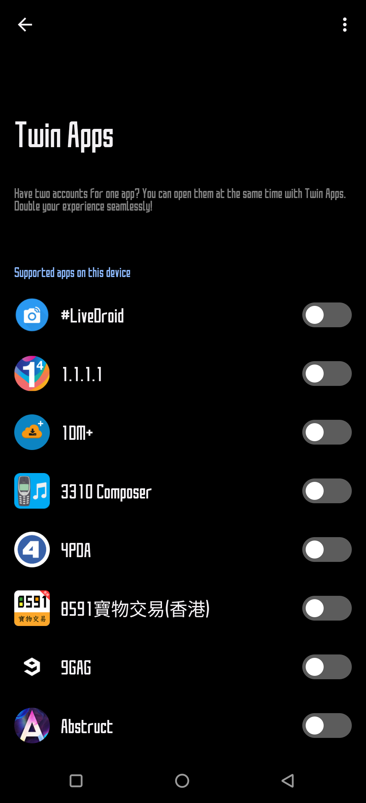

# Twin Apps Enabler
Enables all apps for cloning from "Advanced -> Twin Apps" in ZenUI phones (ASUS, ROG)

## Usage

1. Install Automate

- Though this app is paid, flows under 20 blocks can be run for free. 
- This flow has only 6 blocks, so payment is not required. 

2. Import "TwinAppsEnabler.flo"
3. Run and enjoy

## Results

All apps show up in "Twin Apps" menu (loading now takes some time)

## Reference 

https://medium.com/@shakalaca/zenfone-add-new-apps-to-twin-apps-5b5d4f77a198

